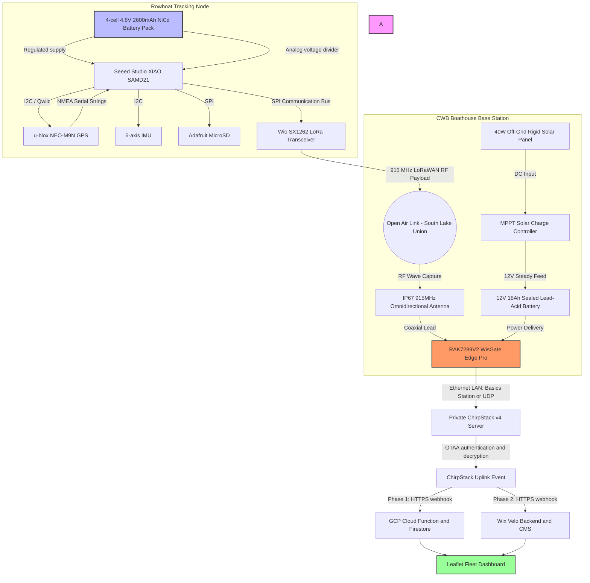
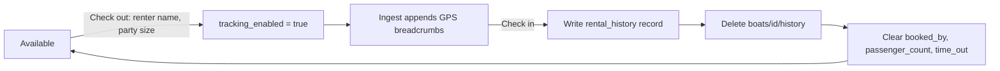

# CWB Rowboat Tracking System — Architecture

Low-power GPS tracking for the Center for Wooden Boats rowboat fleet on South
Lake Union, replacing a paper sign-out sheet with live fleet status, return-time
prediction, and overdue alerting.

**Status (updated 2026-09-15):** The GCP POC is deployed. A private LoRaWAN
network server is the production target; Wix remains the planned post-POC
application platform. The next tracker hardware revision is approved for
engineering but its firmware is not yet implemented. The GCP dashboard and
Cloud Functions implement the four-state battery workflow.

---

## 1. Operating context

CWB offers free one-hour rows on a first-come, first-served basis. Staff record
check-out and check-in on paper, which is frequently missed. When boats are
overdue, volunteers watch the lake and may launch a rescue boat.

The system must therefore answer three questions continuously: which boats are
out, how long they have been out, and which are likely to be late.

Because it tracks the precise location of named members of the public, data
minimisation is a design constraint rather than a feature. See
`docs/privacy-compliance-review.md`.

---

## 2. System context



---

## 3. End-to-end data flow

1. The target tracker wakes every 5 minutes, performs one measurement and
   transmission cycle, then returns to its low-power state. The deployed data
   model continues to permit an administrator-selected 1–60 minute interval.
2. It acquires a 3D GPS fix, samples the six-axis IMU, and reads pack voltage
   through an analog divider. MicroSD is available for approved local buffering,
   but renter-linked location logging remains disabled until retention and
   physical-recovery rules are defined.
3. It transmits a packed 16-byte LoRaWAN uplink on FPort 1 and returns to deep
   sleep.
4. The boathouse gateway forwards the frame over the CWB LAN to a private
   ChirpStack v4 server.
5. ChirpStack authenticates the device (OTAA), decrypts the frame, and POSTs a
   JSON uplink event to the active application webhook.
6. The webhook decodes the payload, writes fleet state, and conditionally
   appends a location breadcrumb.
7. The dashboard renders fleet state live over a websocket listener.

The tracker has no knowledge of the gateway, network server, webhook URL, GCP,
or Wix. Changing application platform is a network-server configuration change.

---

## 4. Tracker node hardware

| Function | Part | Interface |
| :--- | :--- | :--- |
| MCU | Seeed Studio XIAO SAMD21 | — |
| LoRaWAN radio | Wio-SX1262 for XIAO (US915) | SPI |
| GNSS | SparkFun NEO-M9N (Qwiic) | I²C |
| Local storage | Adafruit MicroSD breakout | SPI |
| Motion | Six-axis accelerometer/gyroscope (exact part pending) | I²C |
| Battery sensing | Analog voltage divider to a SAMD21 ADC input | Analog |
| Power | Four-cell 4.8 V, 2600 mAh NiCd battery pack | Regulated supply required |
| Antenna | 915 MHz IP67 omnidirectional | SMA |

The battery pack must not be connected directly to a 3.3 V rail. The final
power design must specify a regulator whose input range and dropout remain
valid through the usable NiCd discharge curve. The voltage divider must keep
the highest expected charged-pack voltage below the selected ADC reference and
must be calibrated against a meter before battery thresholds are accepted.

This approved revision replaces the previously documented RV-1805, LIS3DH,
and AMG8833 sensor arrangement. The exact six-axis IMU, regulator, divider
resistors, MicroSD wiring, and wake source remain engineering selections.

---

## 5. Firmware

Single canonical source: `firmware/src/main.cpp`, built with PlatformIO for
`seeed_xiao`. It still implements the previous RV-1805, LIS3DH, AMG8833, and
three-minute default cycle. Updating the source and protocol handling for the
approved hardware revision is pending.

### 5.1 Wake cycle

The target duty cycle is five minutes: wake, power the required peripherals,
acquire a sample, transmit once, then return the MCU and peripherals to their
lowest practical power states. If local writes are later enabled under an
approved retention policy, they must be flushed before sleep. Actual active
duration and current draw must be measured on assembled hardware; a five-minute
interval alone is not a battery-runtime estimate.

After each FPort 1 uplink, the Class A receive windows accept an optional
one-byte downlink on FPort 2. Values from 1 through 60 reprogram the interval in
minutes; malformed payloads, other ports, and out-of-range values are ignored.

### 5.2 Battery measurement and presentation

The battery is a four-cell, 4.8 V nominal NiCd pack. Thresholds refer to total
pack voltage measured under the normal active load, not voltage per cell:

| Indicator | Pack voltage | Meaning |
| :--- | :--- | :--- |
| Green | `> 4.8 V` | Normal operating range |
| Amber | `> 4.4 V` and `<= 4.8 V` | Recharge should be planned |
| Red | `> 4.0 V` and `<= 4.4 V` | Recharge required |
| Critical | `<= 4.0 V` | Stop discharge to reduce cell-reversal risk |

The dashboard uses a familiar battery icon with green, amber, red, critical,
and unverified states; voltage remains available in its accessible label and
tooltip. Checkout requires a plausible reading received within 15 minutes. Red
checkout requires a manager or administrator reason code and records a
one-trip audit event; critical checkout cannot be overridden. Charging removes
the boat from availability, and reinstall requires three consecutive green
tracker readings with strictly increasing LoRaWAN frame counters before
checkout is restored. The current firmware's 4.2 V flag remains in protocol v1
for compatibility; server and dashboard decisions use measured voltage.

### 5.3 Mooring detection and the dock geofence

Mooring state is derived from accelerometer variance over a 3-second window at
10 Hz (N = 30). Orientation independence comes from reducing each sample to a
scalar magnitude:

$$|a| = \sqrt{a_x^2 + a_y^2 + a_z^2}, \qquad \sigma^2 = \frac{1}{N}\sum_{i=1}^{N}(|a|_i - \mu)^2$$

A vessel below `0.025 g²` is treated as tied up.

**The classifier only runs inside the dock geofence.** GPS is acquired first; if
there is no 3D fix, or the fix lies outside a 55 m circle centred on
`47.62795, -122.33645`, the accelerometer is never powered up and no mooring
determination is made. This prevents calm open water from being misread as
"tied up", and it saves the sampling window's energy on most wakes.

Flag bit 4 tells the server whether a determination was actually made, so
downstream systems can distinguish "underway at dock" from "not evaluated".

---

## 6. Telemetry protocol v1

Packed little-endian, 16 bytes, asserted at compile time.

| Bytes | Type | Field | Encoding |
| :--- | :--- | :--- | :--- |
| 0 | `uint8` | Protocol version | `1` |
| 1–4 | `int32` | Latitude | degrees × 10⁷ |
| 5–8 | `int32` | Longitude | degrees × 10⁷ |
| 9–10 | `uint16` | Battery | millivolts |
| 11–12 | `uint16` | Motion variance | g² × 100,000 |
| 13–14 | `int16` | Max thermal pixel | °C × 100 |
| 15 | `uint8` | Flags | see below |

Flags: bit 0 low battery · bit 1 GPS fix · bit 2 tied up · bit 3 thermal valid ·
bit 4 mooring classification valid.

Both decoders reject unknown versions and wrong-length frames rather than
misinterpreting them. Device identity comes from the network server
(`deviceInfo.devEui`), not the payload.

---

## 7. LoRaWAN network

A private ChirpStack v4 deployment on the CWB LAN removes recurring network
fees and keeps raw location data on site. Full runbook:
`docs/private-chirpstack.md`.

- Gateway connects by Basics Station (`:3001`) or Semtech UDP (`:1700`).
- Device profile: US915, LoRaWAN 1.1.0, RP001 1.1 rev A, OTAA, Class A.
- HTTP integration posts JSON with an `event=up` query parameter.
- Every webhook request carries an `X-CWB-Webhook-Token` header; both adapters
  reject requests without it and ignore non-uplink events.

ChirpStack initiates outbound HTTPS, so the server needs no inbound exposure.

---

## 8. Application platforms

One firmware, two interchangeable adapters that consume the same protocol.

### Phase 1 — GCP (current)

`telemetryIngest` Cloud Function decodes the frame and writes to Firestore. The
static vanilla-JS frontend is served by Firebase Hosting:

| Page | Purpose |
| :--- | :--- |
| `index.html` | Operations dashboard: fleet table, alerts, last position, and an overdue-only three-point trail with direction arrow |
| `admin.html` | Boat registry, reporting interval target, annual weekly rental schedules, availability |
| `history.html` | Completed-rental log |
| `users.html` | Administrator-only invitations, roles, suspension, MFA reset, and account deletion |
| `mfa.html` | Invitation acceptance and local TOTP enrollment |

The rental simulation, event prototype, and event-type prototype pages and
their Hosting routes were retired on 2026-09-15. The security and penetration
gates fail if those artifacts or routes are restored.

### Phase 2 — Wix

Velo backend writes to a `VesselTelemetry` collection with a nightly 30-day
prune job. Frontend is a Leaflet custom element.

### Switching

Repoint the ChirpStack HTTP integration. No firmware change, no reflash. Keep
GCP live during Wix validation, then retire it.

---

## 9. Firestore data model

```text
boats/{DevEUI}
├── device_id, vessel_name
├── availability_status            available | rented | under_repair
├── report_interval_minutes         desired tracker cadence, 1–60
├── schedule_year, rental_season_start, rental_season_end, rental_schedule
├── tracking_enabled               gates breadcrumb retention
├── booked, booked_by, passenger_count, time_out, actual_time_back
├── battery_service_status         ready | charging | verification
├── battery cycle counters and one-trip override state
├── last_ping { protocol_version, latitude, longitude, battery_mv,
│               battery_health, low_battery, gps_fix, inside_dock_geofence,
│               mooring_classification_valid, mooring_status,
│               variance_g2, max_temperature_c, timestamp }
└── history/{auto}                 GPS breadcrumbs, rental-scoped

rental_history/{auto}              append-only, no identity, no coordinates
└── device_id, vessel_name, checked_out_at, checked_in_at,
    duration_minutes, passenger_count

battery_cycles/{auto}              completed charge-cycle summary
└── device_id, battery_id, start/end voltage, minimum voltage,
    operating minutes, trip count, started_at, ended_at

battery_service_events/{auto}      charging/reinstall/override audit
└── device_id, battery_id, event_type, voltage, reason code when required,
    pseudonymous actor_id when staff initiated, recorded_at, expires_at
```

---

## 10. Rental lifecycle and retention



Breadcrumb retention is gated **server-side** in the ingest function: an idle
boat never accumulates a trail, regardless of client behaviour. Check-in is the
privacy boundary — the journey trail and renter identity are destroyed, and only
a pseudonymous rental record survives.

The retained log keeps a per-boat identifier and exact times, so it is
pseudonymous, not anonymous.

---

## 11. Access control

| Path | Read | Write |
| :--- | :--- | :--- |
| `boats/{id}` | Active admin, manager, or staff with matching live profile/token and Operations access | Admin configuration; MFA Operations rental updates; ingest telemetry |
| `boats/{id}/history` | Active admin, manager, or staff with Operations access | Ingest creates; MFA Operations may delete at check-in |
| `rental_history` | Active admin, manager, or staff with Operations access | Server/admin creation with `hasOnly()` allowlist; immutable afterward |
| `users/{uid}` | Own matching profile; administrators may list | Cloud Functions only |

Rules enforce token/live-profile agreement, verified email, active account
state, roles, function level, and TOTP where required. Configuration and rental
updates are validated against separate key sets, and a boat with
`tracking_enabled == false` may not retain renter identity. Administration
links are hidden by default and revealed only to administrators, but server-side
Rules and callable guards remain the authorization boundary.

---

## 12. Release assurance gates

The repository runs deterministic privacy, endpoint-security, penetration, and
accessibility gates. Cloud Function tests cover authentication, authorization,
retention, webhook constraints, and account lifecycle behavior; Firestore Rules
tests run against the emulator. Dependency audits, CodeQL, Snyk where enabled,
Gitleaks, Dependabot, and pinned CI actions provide additional evidence.

Unresolved findings are recorded in `privacy-policy.json` with an owner and a
`reviewBy` date. **Acknowledgements expire**: once past `reviewBy`, the build
fails. Judgement-based review is guided by
`.github/agents/PrivacyChecker.agent.md`.

---

## 13. Repository layout

```text
firmware/                     canonical tracker firmware (PlatformIO)
platforms/gcp/                cloud-ingest, firestore.rules, frontend
platforms/wix/                Velo backend and frontend
tools/privacy-gate/           build-time privacy checker
tools/security-gate/          GCP endpoint authentication inventory and gate
tools/pentest-gate/           penetration-regression controls
tools/accessibility-gate/     deterministic accessibility controls
docs/                         ChirpStack runbook, privacy review
.github/                      agent, skill, CI workflow
```

One firmware implementation lives on `main` alongside both adapters. Long-lived
platform branches are deliberately avoided so the shared protocol cannot drift.

---

## 14. Build, test, deploy

```bash
pio run --project-dir firmware          # privacy gate runs first
node tools/privacy-gate/privacy-gate.mjs
node tools/security-gate/security-gate.mjs
node tools/pentest-gate/pentest-gate.mjs
node tools/accessibility-gate/accessibility-gate.mjs
firebase functions:secrets:set CHIRPSTACK_WEBHOOK_TOKEN
gcloud firestore fields ttls update expires_at --collection-group=_ingest_receipts --enable-ttl
npm run deploy -- --all
```

Production pages fail closed when `firebaseConfig` is unconfigured. Seeded demo
helpers are developer-only and are not a production authentication fallback.
Production OTAA keys and webhook tokens are never committed.

---

## 15. Open decisions

| Item | Owner |
| :--- | :--- |
| MHMDA applicability determination for recreational rowing | Counsel |
| Consent artifact and published privacy policy | Operations |
| Whether minors may be renters (COPPA) | Operations |
| Select the exact six-axis IMU, regulator, divider values, and wake source | Hardware |
| Port firmware from RV-1805/LIS3DH/AMG8833 to the approved hardware revision | Firmware |
| Validate five-minute-cycle current draw and 2600 mAh pack runtime on hardware | Hardware |
| Calibrate voltage thresholds and divider readings on assembled hardware | Hardware/Firmware |
| Decide whether telemetry protocol v2 removes thermal data or reuses those bytes | Technical |