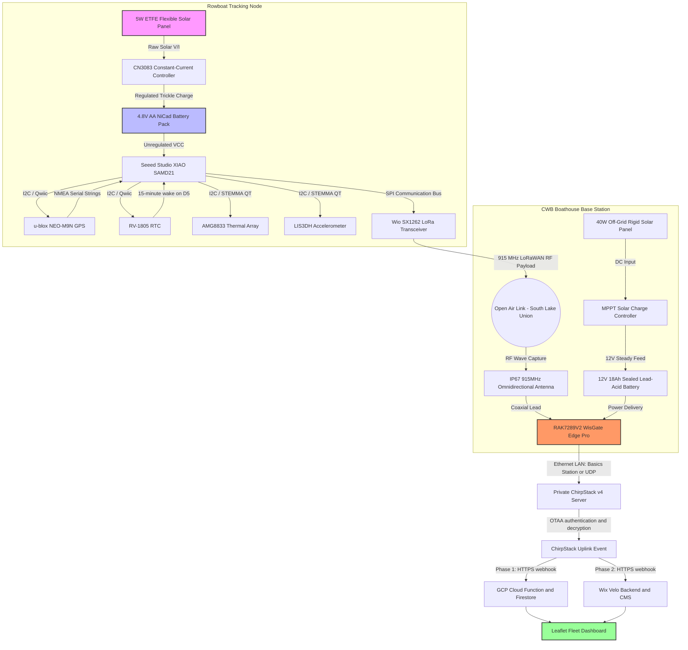
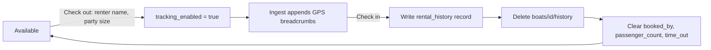

# CWB Rowboat Tracking System — Architecture

Low-power GPS tracking for the Center for Wooden Boats rowboat fleet on South
Lake Union, replacing a paper sign-out sheet with live fleet status, return-time
prediction, and overdue alerting.

**Status:** POC on GCP. A private LoRaWAN network server is the target for
production; Wix is the planned post-POC application platform.

---

## 1. Operating context

CWB offers free one-hour rows on a first-come, first-served basis. Staff record
check-out and check-in on paper, which is frequently missed. When boats are
overdue, volunteers watch the lake and may launch a rescue boat.

The system must therefore answer three questions continuously: which boats are
out, how long they have been out, and which are likely to be late.

Because it tracks the precise location of named members of the public, data
minimisation is a design constraint rather than a feature. See
`docs/privacy-compliance-review.md`.

---

## 2. System context



---

## 3. End-to-end data flow

1. The tracker wakes every 15 minutes on an external RTC alarm.
2. It acquires a 3D GPS fix, conditionally samples motion, and reads battery and
   thermal values.
3. It transmits a packed 16-byte LoRaWAN uplink on FPort 1 and returns to deep
   sleep.
4. The boathouse gateway forwards the frame over the CWB LAN to a private
   ChirpStack v4 server.
5. ChirpStack authenticates the device (OTAA), decrypts the frame, and POSTs a
   JSON uplink event to the active application webhook.
6. The webhook decodes the payload, writes fleet state, and conditionally
   appends a location breadcrumb.
7. The dashboard renders fleet state live over a websocket listener.

The tracker has no knowledge of the gateway, network server, webhook URL, GCP,
or Wix. Changing application platform is a network-server configuration change.

---

## 4. Tracker node hardware

| Function | Part | Interface |
| :--- | :--- | :--- |
| MCU | Seeed Studio XIAO SAMD21 | — |
| LoRaWAN radio | Wio-SX1262 for XIAO (US915) | SPI |
| GNSS | SparkFun NEO-M9N (Qwiic) | I²C |
| Wake timer | SparkFun RV-1805 RTC (Qwiic) | I²C + INT on D5 |
| Motion | Adafruit LIS3DH | I²C `0x18`/`0x19` |
| Thermal array | Adafruit AMG8833 (STEMMA QT) | I²C `0x68` |
| Power | 5 W ETFE solar → CN3083 → 4.8 V NiCad | — |
| Antenna | 915 MHz IP67 omnidirectional | SMA |

**Two wiring constraints are not optional.** The RV-1805 and AMG8833 both
default to I²C address `0x69`; the AMG8833 address jumper must be closed to
select `0x68`. The RV-1805 must run from unswitched 3.3 V so it keeps time while
the rest of the board is powered down.

The MLX90621 (16×4) is retained as evaluation hardware only. Melexis ships an
Mbed-specific I²C driver that does not compile for Arduino SAMD21 without a
`Wire` port, so it is excluded from the production build.

---

## 5. Firmware

Single canonical source: `firmware/src/main.cpp`, built with PlatformIO for
`seeed_xiao`. Current footprint is roughly 19% RAM and 39% flash.

### 5.1 Wake cycle

The RV-1805 countdown timer drives a 15-minute cycle. On wake the firmware
enables the sensor rail, acquires GPS, samples conditionally, transmits, and
re-enters `standby`. The accelerometer is returned to `POWERDOWN` and the radio
to `sleep` before the MCU sleeps.

### 5.2 Mooring detection and the dock geofence

Mooring state is derived from accelerometer variance over a 3-second window at
10 Hz (N = 30). Orientation independence comes from reducing each sample to a
scalar magnitude:

$$|a| = \sqrt{a_x^2 + a_y^2 + a_z^2}, \qquad \sigma^2 = \frac{1}{N}\sum_{i=1}^{N}(|a|_i - \mu)^2$$

A vessel below `0.025 g²` is treated as tied up.

**The classifier only runs inside the dock geofence.** GPS is acquired first; if
there is no 3D fix, or the fix lies outside a 55 m circle centred on
`47.62795, -122.33645`, the accelerometer is never powered up and no mooring
determination is made. This prevents calm open water from being misread as
"tied up", and it saves the sampling window's energy on most wakes.

Flag bit 4 tells the server whether a determination was actually made, so
downstream systems can distinguish "underway at dock" from "not evaluated".

---

## 6. Telemetry protocol v1

Packed little-endian, 16 bytes, asserted at compile time.

| Bytes | Type | Field | Encoding |
| :--- | :--- | :--- | :--- |
| 0 | `uint8` | Protocol version | `1` |
| 1–4 | `int32` | Latitude | degrees × 10⁷ |
| 5–8 | `int32` | Longitude | degrees × 10⁷ |
| 9–10 | `uint16` | Battery | millivolts |
| 11–12 | `uint16` | Motion variance | g² × 100,000 |
| 13–14 | `int16` | Max thermal pixel | °C × 100 |
| 15 | `uint8` | Flags | see below |

Flags: bit 0 low battery · bit 1 GPS fix · bit 2 tied up · bit 3 thermal valid ·
bit 4 mooring classification valid.

Both decoders reject unknown versions and wrong-length frames rather than
misinterpreting them. Device identity comes from the network server
(`deviceInfo.devEui`), not the payload.

---

## 7. LoRaWAN network

A private ChirpStack v4 deployment on the CWB LAN removes recurring network
fees and keeps raw location data on site. Full runbook:
`docs/private-chirpstack.md`.

- Gateway connects by Basics Station (`:3001`) or Semtech UDP (`:1700`).
- Device profile: US915, LoRaWAN 1.1.0, RP001 1.1 rev A, OTAA, Class A.
- HTTP integration posts JSON with an `event=up` query parameter.
- Every webhook request carries an `X-CWB-Webhook-Token` header; both adapters
  reject requests without it and ignore non-uplink events.

ChirpStack initiates outbound HTTPS, so the server needs no inbound exposure.

---

## 8. Application platforms

One firmware, two interchangeable adapters that consume the same protocol.

### Phase 1 — GCP (current)

`telemetryIngest` Cloud Function decodes the frame and writes to Firestore. The
static frontend is three vanilla-JS pages served by Firebase Hosting:

| Page | Purpose |
| :--- | :--- |
| `index.html` | Operations dashboard: fleet table, alerts, Leaflet/OpenStreetMap, resizable split |
| `admin.html` | Boat registry, annual weekly rental schedules, availability |
| `history.html` | Completed-rental log |

### Phase 2 — Wix

Velo backend writes to a `VesselTelemetry` collection with a nightly 30-day
prune job. Frontend is a Leaflet custom element.

### Switching

Repoint the ChirpStack HTTP integration. No firmware change, no reflash. Keep
GCP live during Wix validation, then retire it.

---

## 9. Firestore data model

```text
boats/{DevEUI}
├── device_id, vessel_name
├── availability_status            available | rented | under_repair
├── schedule_year, rental_season_start, rental_season_end, rental_schedule
├── tracking_enabled               gates breadcrumb retention
├── booked, booked_by, passenger_count, time_out, actual_time_back
├── last_ping { protocol_version, latitude, longitude, battery_mv,
│               low_battery, gps_fix, inside_dock_geofence,
│               mooring_classification_valid, mooring_status,
│               variance_g2, max_temperature_c, timestamp }
└── history/{auto}                 GPS breadcrumbs, rental-scoped

rental_history/{auto}              append-only, no identity, no coordinates
└── device_id, vessel_name, checked_out_at, checked_in_at,
    duration_minutes, passenger_count
```

---

## 10. Rental lifecycle and retention



Breadcrumb retention is gated **server-side** in the ingest function: an idle
boat never accumulates a trail, regardless of client behaviour. Check-in is the
privacy boundary — the journey trail and renter identity are destroyed, and only
a pseudonymous rental record survives.

The retained log keeps a per-boat identifier and exact times, so it is
pseudonymous, not anonymous.

---

## 11. Access control

| Path | Read | Write |
| :--- | :--- | :--- |
| `boats/{id}` | public | `admin` claim, key-restricted |
| `boats/{id}/history` | public | ingest only; `admin` may delete |
| `rental_history` | public | `admin` create only, `hasOnly()` allowlist |

Rules enforce two invariants that code alone cannot: configuration and rental
updates are validated against separate key sets, and a boat with
`tracking_enabled == false` may not retain `booked_by`.

**Known gap:** public read currently exposes renter identity alongside live
coordinates. Tracked as finding P001 with a remediation plan.

---

## 12. Build-time privacy gate

`tools/privacy-gate/privacy-gate.mjs` encodes the mechanically checkable privacy
rules and runs before every firmware build (PlatformIO `extra_scripts`), before
the Firebase deploy task, and in CI.

Unresolved findings are recorded in `privacy-policy.json` with an owner and a
`reviewBy` date. **Acknowledgements expire**: once past `reviewBy`, the build
fails. Judgement-based review is guided by
`.github/agents/PrivacyChecker.agent.md`.

---

## 13. Repository layout

```text
firmware/                     canonical tracker firmware (PlatformIO)
platforms/gcp/                cloud-ingest, firestore.rules, frontend
platforms/wix/                Velo backend and frontend
tools/privacy-gate/           build-time privacy checker
docs/                         ChirpStack runbook, privacy review
.github/                      agent, skill, CI workflow
```

One firmware implementation lives on `main` alongside both adapters. Long-lived
platform branches are deliberately avoided so the shared protocol cannot drift.

---

## 14. Build, test, deploy

```bash
pio run --project-dir firmware          # privacy gate runs first
node tools/privacy-gate/privacy-gate.mjs
gcloud functions deploy telemetryIngest --runtime nodejs18 --trigger-http \
  --allow-unauthenticated \
  --set-secrets CHIRPSTACK_WEBHOOK_TOKEN=chirpstack-webhook-token:latest
firebase deploy --only hosting
```

The frontend falls back to seeded demo data when `firebaseConfig` is
unconfigured, so the dashboard can be reviewed without cloud credentials.
Production OTAA keys and webhook tokens are never committed.

---

## 15. Open decisions

| Item | Owner |
| :--- | :--- |
| Split renter identity out of the publicly readable boat document (P001) | Technical |
| MHMDA applicability determination for recreational rowing | Counsel |
| Consent artifact and published privacy policy | Operations |
| Whether minors may be renters (COPPA) | Operations |
| Server-side atomic erasure plus scheduled purge backstop | Technical |
| Retain or drop `max_temperature_c` | Technical |
| Separate `staff` claim for dock operations | Technical |