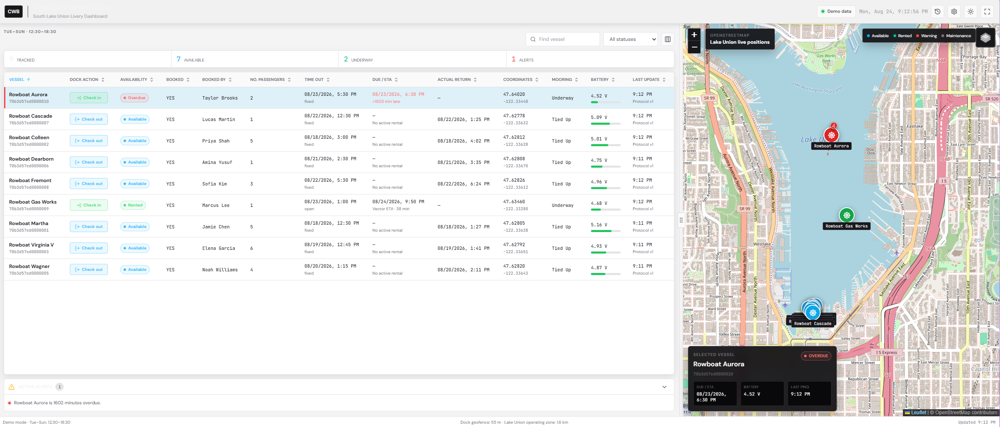
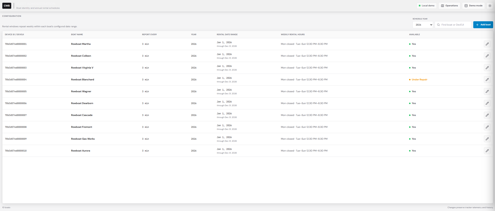
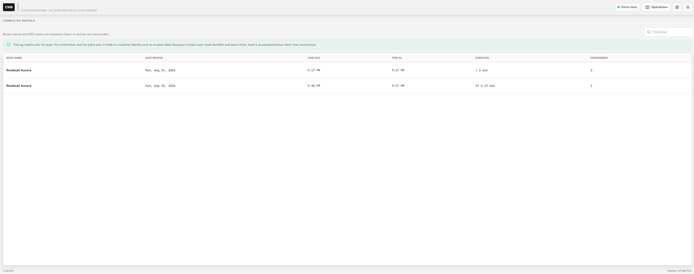

## Problem Statement
The Center for Wooden Boats in Seattle offers free 1 hour rows on two specific row boats. It is first come first served. When a customer takes out a boat, the customer details are logged in a paper tracker with the time out and when they return the time in. Sometimes people forget to do the logging. When customers arrive and there are no boats available they have to wait until a boat returns. Sometimes the previous users are late and the livery volunteers to watch for this and get a rescue boat to go out and tow them in. This slows downs the operation. Additionally, next year, the CWB will introduce a digital system allowing pre-booking. The ideal behind this project is to place a tracker on each row boat that will provide frequent pings LoRa transmissions wiht the boat's ID and GPS coordinates. The webfront consumin this data will show when each boat when out, how long its been out there and if its going to be late based on the current vector so that alerts can be sent.

## Dashboard & Mapping
Operations Dashboard


Boat Administration


Rental History



## Marine Fleet Telemetry & Mooring Detection System

Complete edge-to-cloud architecture stack orchestrating low-power asset tracking, automated cloud stream ingestion, and real-time open-map vessel visualizations.

## Hardware

Approved next tracker revision (2026-09-15):

- Seeed Studio XIAO SAMD21
- Wio-SX1262 LoRa transceiver for XIAO (US915)
- SparkFun u-blox NEO-M9N GNSS breakout
- Adafruit MicroSD breakout
- Six-axis accelerometer/gyroscope; exact part pending
- Analog voltage divider for pack-voltage measurement; resistor values pending
- Four-cell 4.8 V, 2600 mAh NiCd battery pack with a suitable regulated supply
- 915 MHz waterproof omnidirectional antenna
- RAKwireless WisGate Edge Pro gateway

### Firmware Hardware Configuration

The checked-in firmware still uses the NEO-M9N, RV-1805, AMG8833, LIS3DH, and
Wio-SX1262 with a three-minute default reporting interval. It has not yet been
ported to the approved MicroSD/six-axis IMU hardware or the five-minute target
cycle. The NEO-M9N is supported by SparkFun's u-blox GNSS v3 library.

The RV-1805 and AMG8833 both default to I2C address `0x69`. Close the AMG8833 address jumper to select `0x68`; the firmware is configured for that address. Connect the RV-1805 `INT` output to XIAO pin D5 and power the RTC from an unswitched 3.3V supply so it remains active while the other sensors sleep.

The four-cell NiCd pack is graded under normal active load: green above 4.8 V,
amber from above 4.4 V through 4.8 V, red from above 4.0 V through 4.4 V, and
critical at or below 4.0 V. These are total pack voltages. The GCP dashboard
uses a color-coded battery icon and keeps measured voltage in its accessible
detail. Checkout requires telemetry received within 15 minutes. Red checkout
requires an audited manager or administrator reason code; critical checkout is
prohibited. Charging and three increasing-frame, green post-installation
readings remove a boat from availability. The current firmware's 4.2 V
compatibility flag and divider calibration still require hardware follow-up.

---

## Data Storage and Webpage
Initially the webpage will be hosted in GCP using firebase to store the data  for the POC phase. However, longer term this imposes a cost on the CWB which, being a charity, is not desirible.

The LoRaWAN network is independent of Helium. An outdoor US915 gateway on the boathouse forwards packets over the CWB Ethernet LAN to a private ChirpStack v4 server. ChirpStack authenticates OTAA devices, decrypts uplinks, and sends JSON HTTP events to the selected application adapter. During the POC the adapter is GCP; after approval the ChirpStack HTTP integration is changed to Wix without modifying or reflashing the tracker firmware.

See `docs/private-chirpstack.md` for server, gateway, device-profile, and webhook setup.

Post-POC the following approach will be taken:
### Wix Velo Dev Mode
Step-by-Step Wix Integration GuideCreate the Wix CMS Database: 
Open your Wix Editor, turn on Dev Mode / Velo, and create a new Content Collection named VesselTelemetry. Add fields for protocolVersion (Number), latitude (Number), longitude (Number), batteryMv (Number), variance (Number), statusString (Text), lowBattery (Boolean), gpsFix (Boolean), insideDockGeofence (Boolean), mooringClassificationValid (Boolean), maxTemperatureC (Number), and timestamp (Date and Time). Expose the webhook API using `platforms/wix/backend/http-functions.js`. Publish the site, then configure the ChirpStack HTTP integration to use `https://yourdomain.com/_functions/telemetryIngest`. Deploy the map using the files under `platforms/wix/frontend`.

## ⚓ Mooring Detection Algorithm & Classification Logic

Distinguishing between an unmanned boat tied up at a dock versus a boat being rowed, drifted, or powered on open water is highly complex. Ocean coastlines and lakes present continuous background wave motions, rendering static absolute-threshold triggers completely useless. 

This platform implements a **Signal Magnitude Variance ($\\sigma^2$) Matrix Pipeline** running over a fast statistical window:

### 1. Vector Magnitude Isolation
To protect calculation metrics from the arbitrary physical installation angle or axial shifting of the device box inside the boat hull, raw 3-axis readings from the **Adafruit LIS3DH** accelerometer ($a_x, a_y, a_z$) are calculated into a single, unified scalar orientation-independent force magnitude vector ($|a|$):

$$|a| = \\sqrt{a_x^2 + a_y^2 + a_z^2}$$

### 2. High-Frequency Windowed Sampling
When the edge processor exits deep sleep mode, it spins up the LIS3DH sensor bus to $10\\text{Hz}$ and samples structural activity for exactly **3 seconds**, resulting in a finite sample dataset length of $N = 30$ continuous magnitude checkpoints.

### 3. Window Mathematical Variance Processing
The microprocessor calculates the mean average ($\\mu$) of the window and solves for statistical magnitude variance over the window slice:

$$\\mu = \\frac{1}{N} \\sum_{i=1}^{N} |a|_i$$

$$\\sigma^2 = \\frac{1}{N} \\sum_{i=1}^{N} (|a|_i - \\mu)^2$$

### 4. Classification Decision Thresholds
The variance classifier is gated by a 55 m circular geofence centered on the CWB dock at `47.62795, -122.33645`. A valid GPS fix must be inside this area before the firmware samples the accelerometer or determines a mooring state.

*   **Inside Geofence:** The variance thresholds below produce either `Tied Up at Dock` or `Underway at Dock`.
*   **Outside Geofence:** The variance window is not sampled and no static/moored determination is attempted. The status is `Outside Dock Geofence` and variance is stored as `null`.
*   **No GPS Fix:** The classifier is not run and mooring status is `Unknown`.

*   **Tied Up at Dock ($\\sigma^2 < 0.025\\text{g}^2$)**: A vessel tethered to fixed docks or heavy mooring slips exhibits clean, low-energy, bounded structural harmonic oscillations. Wave impacts are heavily damped by dock lines and protective bumper friction, compressing variance firmly below the trigger threshold.
*   **Underway / In Use ($\\sigma^2 \\ge 0.025\\text{g}^2$)**: Active oars impacting rowlocks, internal footsteps, or open-water waves throwing an unconstrained hull profile produce transient, high-energy acceleration shocks across multiple axes. This erratic movement increases statistical variance past the baseline limit, flagging an active status.


---

## 📦 System File Registry
*   `firmware/src/main.cpp`: SAMD21 firmware handling NEO-M9N positioning, RV-1805 wake timing, AMG8833 thermal sampling, LIS3DH window calculations, and **RadioLib LoRaWAN OTAA (US915)** 16-byte versioned packaging routines.
*   `platforms/gcp/cloud-ingest/index.js`: Node.js webhook target configured for HTTP **GCP Cloud Function** triggers.
*   `platforms/gcp/frontend/index.html`: Resizable operations dashboard with a sortable, user-configurable fleet table, alerts, last positions, and an overdue-only three-point trail and direction arrow on OpenStreetMap. Column order, visibility, and sorting persist in the browser.
*   `platforms/gcp/frontend/history.html`: Pseudonymous rental history log.
*   `platforms/gcp/frontend/admin.html`: Administrator-only boat registry and annual weekly rental-schedule editor.
*   `platforms/gcp/frontend/users.html`: Administrator-only account invitations and lifecycle management.
*   `platforms/gcp/frontend/mfa.html`: Invitation acceptance and TOTP enrollment.
*   `platforms/gcp/firestore.rules`: Firestore access rules for the GCP POC.
*   `platforms/wix/backend/`: Wix Velo ingestion and retention jobs.
*   `platforms/wix/frontend/`: Wix page and custom-element code.

### Git and Platform Migration

The repository has one platform-neutral firmware implementation. GCP and Wix are deployment adapters for the same versioned telemetry protocol and remain together on `main`.

### Security and Privacy Gates

Configure the repository hook once per clone and install Gitleaks on the development machine:

```bash
git config core.hooksPath .githooks
git hook run pre-commit
```

The pre-commit gate scans staged content for secrets, runs deterministic
privacy, security, penetration-regression, and accessibility checks against the
staged snapshot, verifies every GCP workload against
`tools/security-gate/gcp-endpoints.json`, runs Cloud Function tests when that
source changes, runs Firestore emulator authorization tests when Rules change,
checks staged first-party JavaScript syntax, audits staged npm dependency trees,
and runs PlatformIO static analysis against staged firmware changes. Installed
dependencies remain ignored and are not tracked in Git.

All callable functions require Firebase Authentication; privileged functions and direct Firestore administration also require the admin claim and TOTP. The public ChirpStack transport endpoint requires its Secret Manager token and enforces POST JSON requests, a 64 KiB body limit, per-instance throttling, and replay-safe writes. Pull requests run these authentication tests alongside the privacy gate, JavaScript and firmware checks, production dependency audits, and CodeQL. Dependabot monitors both npm projects and GitHub Actions. In GitHub, enable **Secret scanning** and **Push protection** under **Settings > Security > Code security and analysis**, then require the Project Security Gate and CodeQL checks in the `main` branch protection rules. Repository settings cannot be enabled by a committed workflow file.

### Telemetry Protocol Version 1

Protocol version 1 is a packed 16-byte little-endian frame:

| Bytes | Type | Field | Encoding |
| :--- | :--- | :--- | :--- |
| 0 | `uint8` | Protocol version | `1` |
| 1-4 | `int32` | Latitude | Decimal degrees multiplied by 10,000,000 |
| 5-8 | `int32` | Longitude | Decimal degrees multiplied by 10,000,000 |
| 9-10 | `uint16` | Battery | Millivolts |
| 11-12 | `uint16` | Motion variance | g squared multiplied by 100,000 |
| 13-14 | `int16` | Maximum temperature | Degrees Celsius multiplied by 100 |
| 15 | `uint8` | Flags | Bit 0 low battery, bit 1 GPS fix, bit 2 tied up, bit 3 thermal valid, bit 4 mooring classification valid / inside dock geofence |

The GCP adapter stores the version as `protocol_version`. The Wix adapter stores it as `protocolVersion`. Adapters reject frames with unsupported versions instead of interpreting them with the wrong layout.

* Use short-lived feature branches and merge them into `main`.
* Tag the accepted POC as `gcp-poc-v1.0`.
* Validate Wix while the GCP webhook remains operational.
* Move the LoRaWAN webhook from GCP to Wix without changing or reflashing firmware.
* Tag the approved Wix deployment as `wix-production-v1.0`.
* Remove or archive the GCP adapter later through a normal reviewed change.

---

## 🚀 Execution & Deployment Instructions

### 1. Hardware Integration Flashing
* PlatformIO installs the libraries declared in `firmware/platformio.ini`.
* Modify the credentials (`devEui`, `joinEui`, `nwkKey`, and `appKey`) inside `firmware/src/main.cpp` to match the private ChirpStack device registration.
* Flash onto your **Seeed Studio XIAO SAMD21** board framework.

### 2. GCP Cloud Functions Setup
* Create the webhook secret through Firebase and enable expiry for replay receipts:
  ```bash
  firebase functions:secrets:set CHIRPSTACK_WEBHOOK_TOKEN
  firebase functions:secrets:set CHIRPSTACK_API_TOKEN
  gcloud firestore fields ttls update expires_at --collection-group=_ingest_receipts --enable-ttl
  ```
* Create `production.env` from `production.template` and fill in the production Firebase settings. Deployment fails closed when that file is absent.
* Run `npm run deploy -- --all` from the repository root. This runs the privacy and endpoint-security gates plus Cloud Function authentication tests before deploying hosting, Firestore rules, and all Cloud Functions.
* Configure ChirpStack to use the deployed `telemetryIngest` URL with `Content-Type: application/json` and the `X-CWB-Webhook-Token` header. The function is network-reachable so ChirpStack can call it, but requests without the matching secret are rejected.

### 3. Frontend Map Initialization
* Open `platforms/gcp/frontend/index.html` and replace the `firebaseConfig` object dictionary elements with your web target data properties from your Firebase Console.
* Serve the static index bundle live using Firebase Hosting or your preferred hosting architecture.

### 4. Complete Data Model

The DevEUI is the common identifier across ChirpStack, Firestore, and Wix. Field
names use `snake_case` in GCP and `camelCase` in Wix.

#### 4.1 LoRaWAN application messages

Uplinks use FPort 1 and the 16-byte telemetry protocol documented above.
Reporting-interval commands use FPort 2 with exactly one unsigned byte: the
number of minutes from 1 through 60. The checked-in firmware defaults to 3
minutes and ignores other ports, malformed payloads, and out-of-range values;
the approved next revision changes the default operating cycle to 5 minutes.

ChirpStack sends the GCP or Wix adapter an uplink event shaped as:

```json
{
  "deviceInfo": { "devEui": "70b3d57ed0000001" },
  "fPort": 1,
  "data": "BASE64_ENCODED_16_BYTE_PAYLOAD"
}
```

#### 4.2 Firestore `boats/{DevEUI}`

Each boat document combines configuration, active-rental state, and its latest
telemetry. The ingest function merge-writes `device_id` and `last_ping`, so it
does not overwrite configuration or rental fields.

| Field | Type | Required / lifecycle | Purpose |
| :--- | :--- | :--- | :--- |
| `device_id` | String | Required | Exact 16-character DevEUI and document ID |
| `vessel_name` | String | Required | Human-readable boat name |
| `availability_status` | String enum | Required | `available`, `rented`, or `under_repair`; only `available` and `rented` boats appear on the operations dashboard |
| `report_interval_minutes` | Integer | Required, 1-60 | Desired tracker reporting cadence; saving it does not itself queue a ChirpStack downlink |
| `schedule_year` | Integer | Required | Calendar year governed by the schedule |
| `rental_season_start` | String | Required, `YYYY-MM-DD` | First rentable date in `schedule_year` |
| `rental_season_end` | String | Required, `YYYY-MM-DD` | Last rentable date in `schedule_year` |
| `rental_schedule` | Map | Required | Weekly schedule described below |
| `configuration_updated_at` | Timestamp | Set on admin save | Last configuration write |
| `tracking_enabled` | Boolean | Active-rental state | Server-side gate controlling breadcrumb creation |
| `booked` | Boolean | Active-rental state | Whether the boat has an active booking/rental |
| `booked_by` | String | Present only during rental | Renter name; deleted at check-in |
| `passenger_count` | Integer | Present only during rental, 1-6 | Party size; removed from the boat at check-in |
| `time_out` | Timestamp | Present only during rental | Check-out time; deleted at check-in |
| `actual_time_back` | Timestamp | Optional transient field | Explicit return time when supplied; cleared by the current lifecycle |
| `rental_updated_at` | Timestamp | Set on check-out/check-in | Last rental-state transition |
| `battery_service_status` | String enum | Battery workflow | `ready`, `charging`, or `verification` |
| `battery_override_active` | Boolean | Active rental only | One-trip red-battery override; cleared at check-in |
| `battery_cycle_*` | Timestamp/integer fields | Current charge cycle | Starting/minimum voltage, trip count, and operating minutes |
| `last_ping` | Map | Set by ingest | Latest decoded telemetry, described below |

`rental_schedule` contains all seven lowercase weekday keys. Each value has the
same shape:

```json
{
  "monday": { "enabled": false, "start": "12:30", "end": "18:30" },
  "tuesday": { "enabled": true, "start": "12:30", "end": "18:30" },
  "wednesday": { "enabled": true, "start": "12:30", "end": "18:30" },
  "thursday": { "enabled": true, "start": "12:30", "end": "18:30" },
  "friday": { "enabled": true, "start": "12:30", "end": "18:30" },
  "saturday": { "enabled": true, "start": "12:30", "end": "18:30" },
  "sunday": { "enabled": true, "start": "12:30", "end": "18:30" }
}
```

The dashboard also understands optional `rental_type` (`fixed` or `open`),
`rental_minutes` (default 60), and `time_due_back` (Timestamp) fields for a
future trusted booking integration. Current browser security rules do not
allow those optional fields to be written.

#### 4.3 `last_ping` and `boats/{DevEUI}/history/{autoId}`

While `tracking_enabled` is true, `last_ping` has this decoded telemetry shape
and the ingest function writes the same shape to the boat's `history`
subcollection. When tracking is disabled, `last_ping` omits `latitude` and
`longitude` but retains non-location operational telemetry.

| Field | Type | Meaning |
| :--- | :--- | :--- |
| `protocol_version` | Integer | Telemetry protocol version; currently `1` |
| `latitude` | Number | Decimal degrees |
| `longitude` | Number | Decimal degrees |
| `battery_mv` | Integer | Battery voltage in millivolts |
| `battery_health` | String enum | Server classification: `green`, `amber`, `red`, or `critical` |
| `low_battery` | Boolean | Firmware low-battery flag |
| `gps_fix` | Boolean | Valid 3D GPS fix flag |
| `inside_dock_geofence` | Boolean | Compatibility alias for valid dock-geofence classification |
| `mooring_classification_valid` | Boolean | Whether mooring classification was evaluated inside the firmware geofence |
| `mooring_status` | String enum | `Unknown`, `Outside Dock Geofence`, `Tied Up at Dock`, or `Underway at Dock` |
| `variance_g2` | Number or null | Motion variance in g squared; null when classification was not run |
| `max_temperature_c` | Number or null | Maximum valid AMG8833 pixel temperature in Celsius |
| `timestamp` | Timestamp | Server receive time |

History is rental-scoped precise-location data. The dashboard reads only the
latest three points for an overdue rental to draw its short trail and derive a
direction arrow. Speed, bearing, estimated return time, overdue state, battery
percentage, and operating-zone alerts are derived in the browser and are not
stored fields.

#### 4.4 Battery service and cycle records

`battery_service_events` records charging, reinstall, verification, and
manager/administrator override actions. `battery_cycles` stores completed
charge-cycle voltage, trip-count, and operating-minute summaries. Neither
collection stores renter identity or GPS coordinates. Override actor IDs are
one-way pseudonymous identifiers, not anonymous data. Service events use
controlled reason codes instead of free text and expire after one year.

#### 4.5 Firestore `rental_history/{autoId}`

Check-in writes one append-only retained record, then deletes the boat's GPS
history and active renter fields.

| Field | Type | Meaning |
| :--- | :--- | :--- |
| `device_id` | String | Boat DevEUI |
| `vessel_name` | String | Boat name at check-in |
| `checked_out_at` | Timestamp | Rental start |
| `checked_in_at` | Timestamp | Rental end |
| `duration_minutes` | Integer | Rounded elapsed rental duration |
| `passenger_count` | Integer | Party size |

The retained record contains no renter name or coordinates. Because the DevEUI
and exact times remain, it is pseudonymous, not anonymous.

#### 4.5 Wix `VesselTelemetry`

The phase-2 Wix adapter stores one row per uplink rather than the merged
Firestore boat model.

| Field | Wix type | Meaning |
| :--- | :--- | :--- |
| `title` | Text | Boat DevEUI |
| `protocolVersion` | Number | Telemetry protocol version |
| `latitude`, `longitude` | Number | Decimal-degree GPS position |
| `batteryMv` | Number | Battery voltage in millivolts |
| `variance` | Number or null | Motion variance when classification is valid |
| `statusString` | Text | Mooring status |
| `lowBattery`, `gpsFix` | Boolean | Battery and GPS flags |
| `insideDockGeofence` | Boolean | Compatibility alias for valid classification |
| `mooringClassificationValid` | Boolean | Whether dock mooring was evaluated |
| `maxTemperatureC` | Number or null | Maximum valid thermal pixel temperature |
| `timestamp` | Date and Time | Adapter receive time |

The scheduled Wix cleanup removes `VesselTelemetry` rows older than 30 days in
batches of up to 1,000.

### 5. Fleet Administration

Open `platforms/gcp/frontend/admin.html` to configure boats. Each `boats/{DevEUI}` document can store:

* Device ID and human-readable boat name.
* Schedule year and active start/end dates.
* Enabled state plus rental start/end time for every day of the week.
* Availability as `Yes` (`available`) or `Under Repair` (`under_repair`).
* Reporting interval target from 1 through 60 minutes.

The editor defaults to a full calendar year with Monday closed and Tuesday through Sunday open from 12:30 PM to 6:30 PM. Existing Device IDs are locked in the editor because changing a DevEUI would break its telemetry and history association; create a new boat record when tracker hardware changes.

The **Delete boat** action is available only when editing an existing boat. It
requires confirmation and is blocked while `tracking_enabled` is true. Deletion
removes the boat configuration, latest telemetry, and GPS-history subcollection;
completed pseudonymous records in `rental_history` are retained.

With Firebase configured, administrators sign in using Google. Their Firebase Auth user must have the custom claim `admin: true`. Firestore rules permit these users to update only configuration fields. The Cloud Function continues to write telemetry through the Admin SDK, and browser clients cannot alter `last_ping` or history records.

### 6. Check-Out, Check-In, and Data Retention

Dock staff run rentals from the operations dashboard. Each row carries a toggle in the **Dock action** column.

**Check out** captures the renter name and party size, sets `availability_status` to `rented`, and sets `tracking_enabled` to `true`. The ingest function appends a GPS breadcrumb to `boats/{DevEUI}/history` only while that flag is true, so idle boats never accumulate a location trail.

**Check in** is the privacy boundary. The dashboard workflow:

1. Writes a pseudonymous record to `rental_history` containing only the device ID, boat name, check-out time, check-in time, duration, and passenger count.
2. Deletes every document in `boats/{DevEUI}/history`, destroying the journey trail.
3. Removes `booked_by`, `passenger_count`, and `time_out` from the boat document and sets `tracking_enabled` to `false`.

Firestore rules restrict `rental_history` documents to that exact key set, so a renter name or coordinate cannot be written into the retained log even by mistake. The log is append-only: updates and deletes are denied.

`platforms/gcp/frontend/history.html` presents this log with the boat name, date, times, duration, and party size. Once a rental is closed, no record links a customer to a route.
