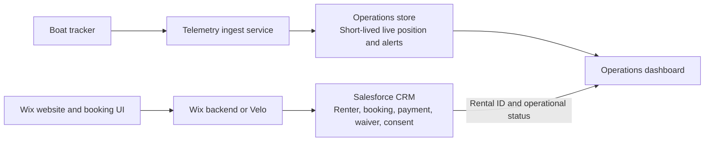

# Salesforce Integration

## Recommendation

CWB can use Wix for its public website and Salesforce as the system of record for CRM and boat-rental operations. Salesforce should hold renter identity, bookings, boat configuration, renter type, payment or waiver status, and recorded consent.

Salesforce is not a suitable primary store for high-frequency location telemetry. Current boat state, alerts, and GPS breadcrumbs should remain in a dedicated operational service with strict retention controls.

## Data Ownership

| System | Data |
| --- | --- |
| Wix | Public pages, booking entry points, and customer-facing forms |
| Salesforce | Renter identity, reservations, renter type, boat type, payment or waiver state, and consent records |
| Operations service | Current boat state, alerts, and GPS trail while a boat is checked out |
| Operations dashboard | Data needed for dock operations only |

## Integration Rules

- Do not call Salesforce directly from Wix browser code or the operations dashboard. Use Wix backend functions or a dedicated server-side integration with OAuth credentials.
- Replace `booked_by` in boat telemetry with a non-identifying `rental_id` that links to Salesforce server-side.
- Keep renter type, boat type, and completed rental records in Salesforce.
- Delete GPS trail data at check-in and add a server-side timed purge if no check-in occurs.
- Do not store renter identity or precise location together in publicly readable records.
- Apply staff-only access, retention, consent, audit, and breach-response controls before production use.

## Privacy Review

Renter type values, such as Volunteer or Library Pass, may reveal affiliation or eligibility. CWB should have counsel confirm the appropriate retention period and access restrictions for these categories. This document is an engineering recommendation, not legal advice.
